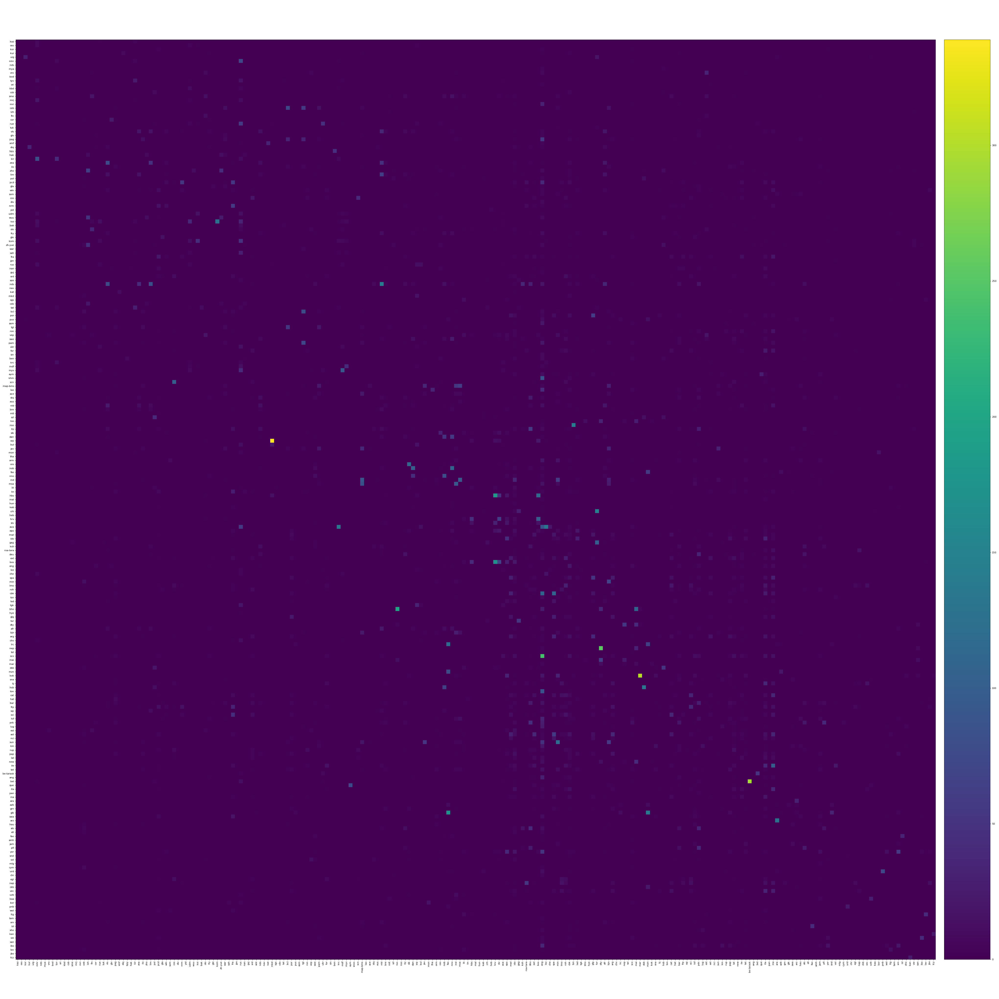
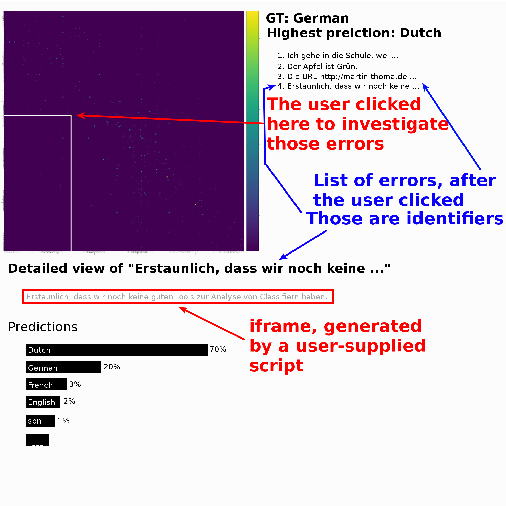

# Confusion Matrices

This module expects the Ground Truth labels to have exactly one value `1` and
only zeros for each data element.

See [File Formats](file-formats.md).

## Static Confusion Matrix

```
$ clan --labels labels.csv --gt gt.csv --preds preds.csv
```

Produces a static confusion matrix:



The labels are by default the short version, but a switch `--long` changes them
to the long version.

Optionally, the command accepts a `permutations.json` which defines another
order of the elements.


## Interactive Confusion Matrix

```
$ clan cm --labels labels.csv --gt gt.csv --preds preds.csv --interactive --viz data_viz.py
```

Starts a webserver with an interactive version of the confusion matrix. The
user can click on each of the confusions and get a list of of the identifiers.
Each identifier has a link on which the user can click again. This will call
the `visualize(identifier)` function within `data_viz.py`.
`visualize(identifier)` has to return an HTML page. That page could simply
contain a string (e.g. for NLP), an image (e.g. Computer Vision) or audio files
(e.g. ASR).

The interface could look like this:


